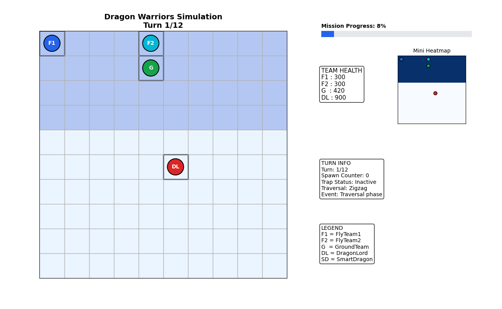

# Dragon Warriors
## How to Train Your Dragon – Part II

---

## Project Overview

Dragon Warriors is a turn-based simulation system implemented in C++.  
The project is inspired by the assignment *How to Train Your Dragon – Part II* from Ho Chi Minh City University of Technology (HCMUT).

The program simulates a battle scenario on a two-dimensional grid map where multiple warrior teams attempt to defeat a central boss entity known as the DragonLord. Each entity follows predefined movement rules, interacts with environmental obstacles, and participates in combat events throughout a fixed number of simulation steps.

The implementation demonstrates the application of object-oriented programming principles, manual memory management, and configuration-driven simulation design.

---

## Learning Objectives

This project aims to reinforce several core programming concepts:

- Object-Oriented Programming in C++
- Use of inheritance, polymorphism, and abstraction
- Manual memory management without the use of STL containers
- Design of configuration-based simulation systems
- Implementation of modular and extensible program architectures

---

## Simulation Overview

The system models a grid-based environment where entities move and interact according to predefined rules. During each simulation step, entities perform movement, combat actions, item interactions, and event processing.

Major components of the simulation include:

- Warrior movement and traversal logic
- Dragon encounters and combat resolution
- Item usage and inventory management
- SmartDragon spawning
- Trap mechanics applied to the DragonLord
- Victory condition evaluation

---

## Game Entities

### FlyTeams

Two aerial warrior teams participate in the simulation:

- FlyTeam1
- FlyTeam2

These entities are capable of:

- Moving according to predefined movement rules (`L`, `R`, `U`, `D`)
- Engaging SmartDragons in combat
- Participating in the final battle against the DragonLord

---

### GroundTeam

The GroundTeam represents a ground-based warrior unit with specialized capabilities:

- Movement across the map grid
- Ability to trap the DragonLord for a number of turns
- Capability to pass Ground Obstacles when sufficient damage is available

---

### DragonLord

The DragonLord is the central boss entity in the simulation.

Characteristics include:

- Movement behavior influenced by the positions of FlyTeam1 and FlyTeam2
- Periodic spawning of SmartDragon entities
- Acting as the final objective of the simulation

---

### SmartDragons

SmartDragons are dynamically generated enemy entities.

Properties include:

- Periodic spawning from the DragonLord
- Target pursuit using Manhattan distance
- Item drops when defeated

---

## Map and Environment

The simulation environment is represented as a two-dimensional grid consisting of multiple terrain types.

| Cell Type | Description |
|----------|-------------|
| PATH | Walkable terrain |
| OBSTACLE | Completely blocked cell |
| GROUND_OBSTACLE | Passable only by GroundTeam when sufficient damage is available |

All entity movements must respect these environmental constraints.

---

## Item System

Warrior entities may acquire and utilize items during the simulation.

### Item Types

| Item | Description |
|-----|-------------|
| DragonScale | Increases attack damage |
| HealingHerb | Restores health points |
| TrapEnhancer | Extends trap duration |

### Bag System

Each warrior owns an inventory container called `BaseBag`.  
Items are automatically used when applicable.  
A higher-level structure, `TeamBag`, manages item distribution across the team.

---

## Simulation Flow

The simulation follows a turn-based execution model.

```
Load Configuration
        ↓
Initialize Map
        ↓
Spawn Entities
        ↓
Start Simulation Loop
        ↓
Entity Movement
        ↓
Combat Resolution
        ↓
Item Handling
        ↓
SmartDragon Spawning
        ↓
Check Victory Conditions
        ↓
Next Turn
```

During each iteration of the simulation loop, entities update their positions, interact with other entities, process combat events, and apply game mechanics.

---

## Simulation Visualization

The following animation illustrates a simplified visualization of the simulation process.  
It demonstrates entity movement, combat interactions, SmartDragon spawning events, and DragonLord trapping behavior on the grid-based map.



---

## Configuration File

The simulation environment is defined using an external configuration file that specifies the initial state and parameters of the system.

The configuration file includes:

- Map dimensions
- Obstacle and terrain positions
- Initial positions of entities
- Health and damage parameters
- Movement rules
- Total number of simulation steps

Example configuration:

```text
MAP_NUM_ROWS=10
MAP_NUM_COLS=10

NUM_OBSTACLE=2
ARRAY_OBSTACLE=[(1,2);(3,4)]

FLYTEAM1_MOVING_RULE=URDL
FLYTEAM1_INIT_POS=(0,0)
FLYTEAM1_INIT_HP=300
FLYTEAM1_INIT_DAMAGE=200

NUM_STEPS=100
```

---

## Project Structure

```
Dragon-Warriors
│
├── dragon.h
├── dragon.cpp
├── main.cpp
├── main.h
│
├── run.sh
├── sa_tc_01_config
│
├── animate_dragon_warriors.py
├── dragon_warriors_simulation.gif
│
├── README.md
└── .gitignore
```

---

## Compilation and Execution

### Compilation (Unix environment)

```bash
g++ -std=c++11 -Wall -Wextra main.cpp dragon.cpp -o dragon
```

### Execution

```bash
./dragon sa_tc_01_config
```

The assignment is evaluated in a Unix-based environment.

---

## Notes

- The implementation follows the official assignment constraints.
- No STL containers are used in the implementation.
- The program is compiled using the C++11 standard.
- The primary simulation logic is implemented within `dragon.cpp`.

---

## Author

Le Hien Vinh  
Ho Chi Minh City University of Technology

